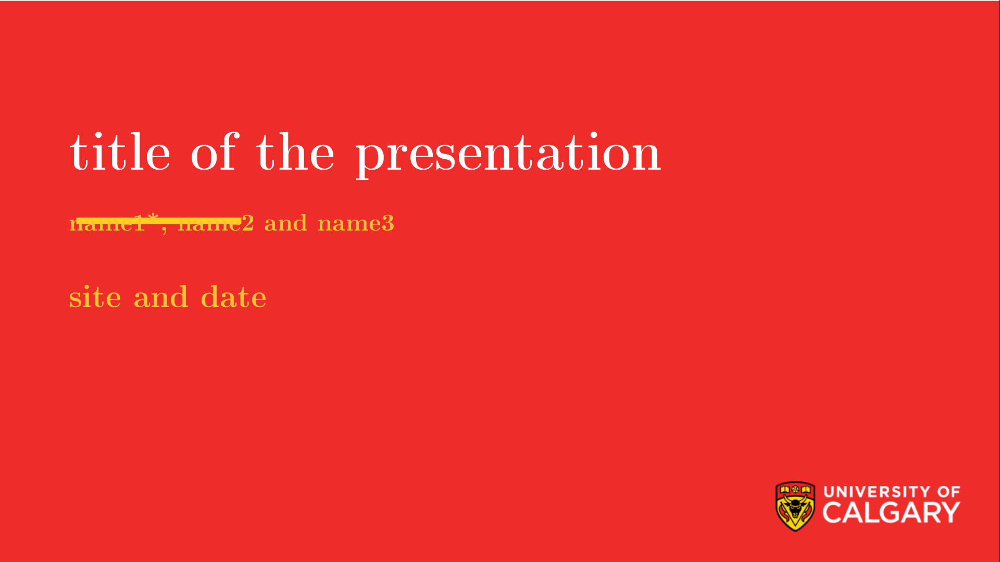
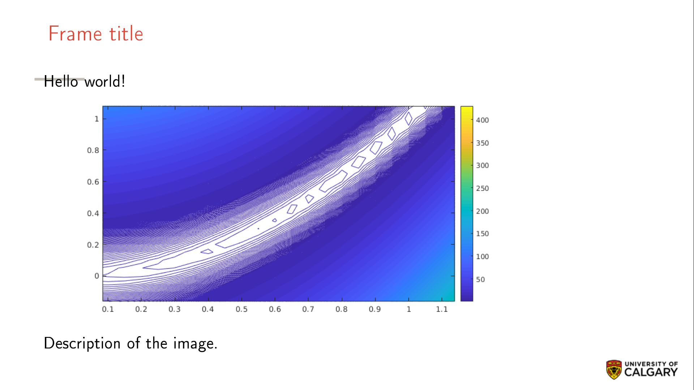
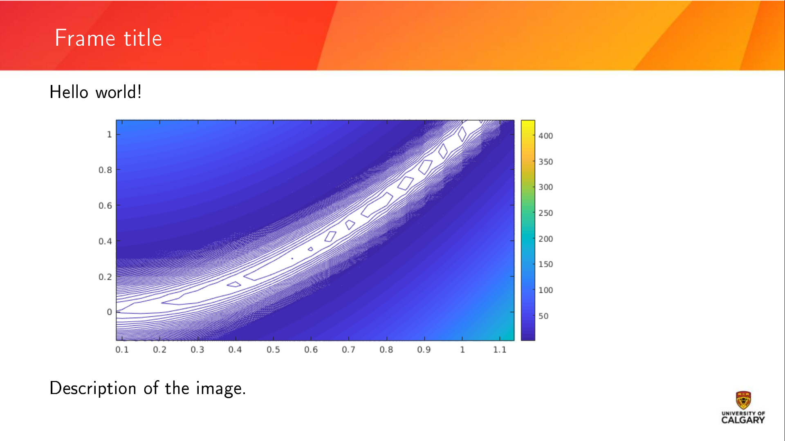
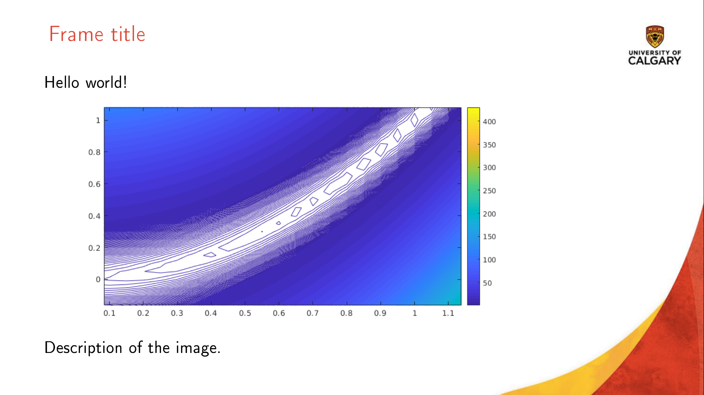
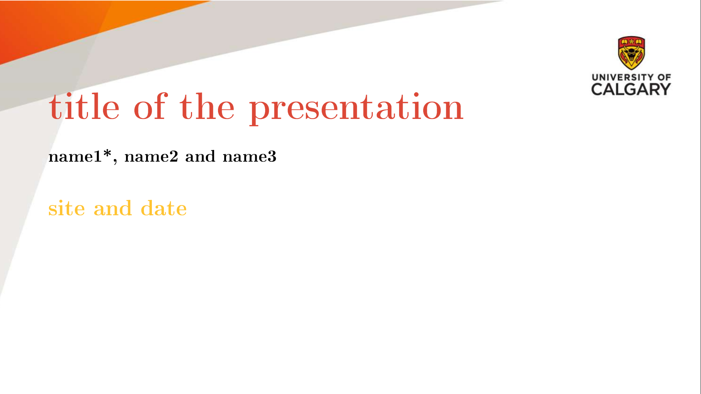
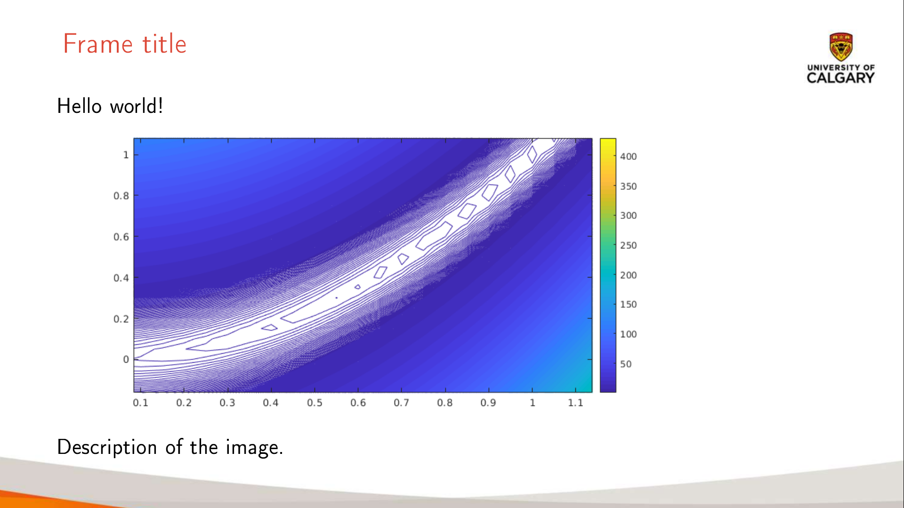

# Beamer package for University of Calgary presentations
This is the beamer theme to format presentations in the current University of Calgary formats.

## Prerequisites

It has been tested with Linux livetex package. It needs testing in other Latex distributions.

Some drawing is done with latex package Tikz and the logos are rendered with
package graphicx.

## Usage

Use beamer as the document class in the Latex source:

`\documentclass[aspectratio=169]{beamer}`

The aspect ratio should be 16:9 for the moment. 
Other aspect ratios will fail.

One of four styles should be used:

# SIMPLE

`\usetheme[style=simple]{uofc}`

# BOLD

`\usetheme[style=bold]{uofc}`

# FLOURISH

`\usetheme[style=flourish]{uofc}`

# CONSERVATIVE

`\usetheme[style=conservative]{uofc}`

You can also use the miniframes option to have a navigation bar on top of the frames:

`\usetheme[style=simple,miniframes]{uofc}`

The packages files should be installed in Latex or at least in the
same directory as the presentation.

The rest of the format follows Beamer conventions. See example.

## Package files

* beamerthemeuofc.sty
* beamerouterthemeuofc.sty
* beamerinnerthemeuofc.sty
* beamerfontthemeuofc.sty
* beamercolorthemeuofc.sty
* Everything inside folder uofcimg

## Example files

* test.tex
* Everything inside folder images

